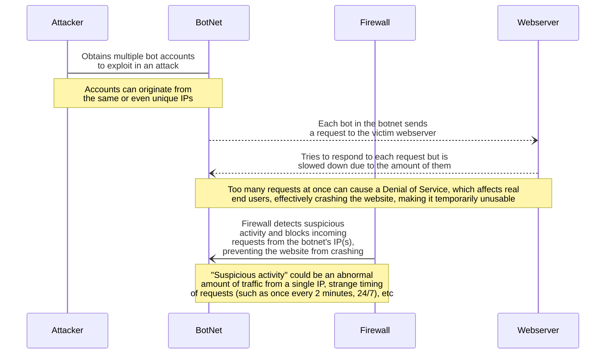

### The order of events in the diagram is as follows:  
 1. An **Attacker** obtains bot accounts with the intention of DDoSing a **Webserver**. These bot accounts can be bought or hacked as a sevice online or configured from their own network with devices they own. All of these bot accounts combined are called a **BotNet**.  
 2. The attacker, through their botnet, sends out a ton of requests to the victim webserver. Normally it's a short request that requires the server to give a lengthy response. For example, a simple HTTP request. It's much more expensive for the server to respond to the botnet than it is for each individual bot to send the request.  
 3. The spam of expensive requests causes the webserver to "jam" while trying to respond to each one. Because it can no longer keep up with the amount of requests, it will eventually cause a Denial-of-Service to webserver traffic. This directly affects all traffic to the webserver, preventing real users from accessing it, effectively crashing the website.  
 4. A **Firewall** tries to prevent DDoS attacks by constantly monitoring for suspicious activity. It looks for an abundance of requests coming from a single IP, consistent patterns from certain accounts (such as devices that send suspicious requests in constant intervals), or generally unexplainable request events. When it detects these events, it works to block the IP(s) that are the source of the suspicious activity, effectively putting an end to the influx of new requests, allowing the victim webserver to "catch up" and resume functioning as normal.